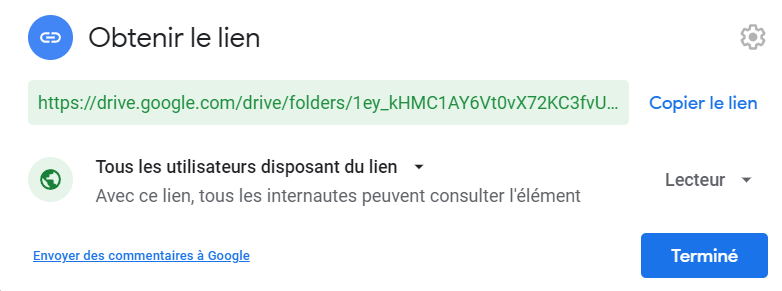

# Drive-album v1.0.0

Transform a google drive folder into an api to stock your images and albums

## Installation ?

```
npm i drive-album
```

## How to use ?

- Dont forget to set the folder in public mode

</img>

```js
const GetGoogleDrive = require('drive-album');

const drive = await GetGoogleDrive("https://drive.google.com/drive/folders/1UJ4PiRfyhPelXacznccRoGBPXLDEDvCb?usp=sharing");
const drive = await GetGoogleDrive("1UJ4PiRfyhPelXacznccRoGBPXLDEDvCb");

//if you want to explore all the subtree folders
await GetGoogleDrive(..., true);
```

## Result
- Subtree exploring
```json
[
    {
        "id": "1e82I6XdsT6Sla4JI6Eg-cfqQFx8PoZbv",
        "name": "ALBUM1",
        "realType": "application/vnd.google-apps.folder",
        "type": "folder",
        "url": "https://drive.google.com/drive/folders/1e82I6XdsT6Sla4JI6Eg-cfqQFx8PoZbv",
        "content": [
            {
                "id": "19mppIinV6H-5yEJrpI_IEV6kOaqcYXYV",
                "name": "testimage.png",
                "realType": "image/png",
                "type": "image",
                "url": "https://lh3.google.com/u/0/d/19mppIinV6H-5yEJrpI_IEV6kOaqcYXYV=w1920-h942-iv2"
            }
        ]
    },
    {
        "id": "1j1bM93BzEUFq9qnxkg83zCU7EagFmdpI",
        "name": "ALBUM2",
        "realType": "application/vnd.google-apps.folder",
        "type": "folder",
        "url": "https://drive.google.com/drive/folders/1j1bM93BzEUFq9qnxkg83zCU7EagFmdpI",
        "content": []
    },
    {
        "id": "18wLall8RXQpEbUn_tOsO_IAXbyCoVaLA",
        "name": "testimage1.png",
        "realType": "image/png",
        "type": "image",
        "url": "https://lh3.google.com/u/0/d/18wLall8RXQpEbUn_tOsO_IAXbyCoVaLA=w1920-h942-iv2"
    }
]
```

- No subtree exploring (You can see the content of a folder with GetGoogleDrive("Folder id"))
```json
[
    {
        "id": "1e82I6XdsT6Sla4JI6Eg-cfqQFx8PoZbv",
        "name": "ALBUM1",
        "realType": "application/vnd.google-apps.folder",
        "type": "folder",
        "url": "https://drive.google.com/drive/folders/1e82I6XdsT6Sla4JI6Eg-cfqQFx8PoZbv",
    },
    {
        "id": "1j1bM93BzEUFq9qnxkg83zCU7EagFmdpI",
        "name": "ALBUM2",
        "realType": "application/vnd.google-apps.folder",
        "type": "folder",
        "url": "https://drive.google.com/drive/folders/1j1bM93BzEUFq9qnxkg83zCU7EagFmdpI",
    },
    {
        "id": "18wLall8RXQpEbUn_tOsO_IAXbyCoVaLA",
        "name": "testimage1.png",
        "realType": "image/png",
        "type": "image",
        "url": "https://lh3.google.com/u/0/d/18wLall8RXQpEbUn_tOsO_IAXbyCoVaLA=w1920-h942-iv2"
    }
]
```

## Example
```js
const GetGoogleDrive = require('drive-album');
const fs = require('fs');

async function test(){
    const drive = await GetGoogleDrive("1UJ4PiRfyhPelXacznccRoGBPXLDEDvCb", true);
    fs.writeFileSync("test.json", JSON.stringify(drive, undefined, 4));
}

test();
```